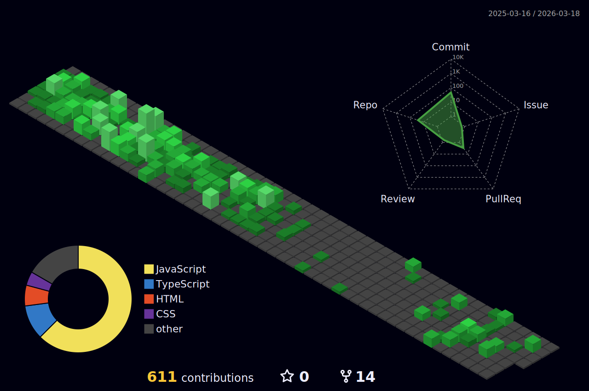

 

  <h1 align='center'>

 
 
</h1>

<h3 align='center'>
  A passionate Frontend Developer from India 
</h3>

  

    
  

<!-- https://komarev.com/ghpvc/?username=Rupesh-klr -->

## 🧑‍💻 About Me

Hi! I'm **Rupesh**, a Full Stack Software Developer with a background in Computer Science. I specialize in building robust applications using **Spring Boot** and **Python** on the backend, paired with **React** and **TypeScript** on the frontend. I also have a strong interest in **DevOps** practices, ensuring my code is not just functional but deployable and scalable.

---

##  Connect with Me

  
  
  
  

---

## 🛠️ Tech Stack

   
  
  
  
  
  <!--  -->
  
  
  
  
  
  

<h2 align='center'><strong>Languages, Tools and Technologies 🚀 </strong></h2>
	 
<table>
	<tr>
		<td><strong>Programming Languages</strong></td>
		<td></td>
	</tr>
	<tr>
		<td><strong>Frontend Development</strong></td>
		<td></td>
	</tr>
	<tr>
		<td><strong>Backend Development</strong></td>
		<td></td>
	</tr>
	<tr>
	<tr>
		<td><strong>Database Technologies</strong></td>
		<td></td>
	</tr>
	<tr>
		<td><strong>Frameworks</strong></td>
		<td></td>
	</tr>
	<tr>
		<td><strong>Cloud Deployment</strong></td>
		<td></td>
	</tr>
	<tr>
		<td><strong>Hosting Services</strong></td>
		<td></td>
	</tr>
	<tr>
		<td><strong>Developer Tools</strong></td>
		<td> 
	</td>
	</tr>
	<tr>
		<td><strong>Debugging Tools</strong></td>
		<td>  &nbsp; &nbsp; &nbsp; &nbsp;&nbsp;</td>
	</tr>
	<tr>
		<td><strong>Collaboration Platforms</strong></td>
		<td>  </td>
	</tr>
	<tr>
		<td><strong>Operating System</strong></td>
		<td>
		  </a>  <a href="https://www.cprogramming.com/" target="_blank" rel="noreferrer">
		</td>
	</tr>
</table>

---
## ‍🎃 Coding Profile:

  

---

## 🎯 What I'm Currently Focusing On

- 🔐 Designing secure, scalable architectures for **Banking & Telecom** domains
- ⚛️ Mastering **Advanced React patterns** (Biometric Auth, Universal Data Layers, Redux State)
- 🚀 Implementing **DevOps best practices** with Docker and CI/CD pipelines
- ☕ Deepening expertise in **Spring Boot Microservices** and Distributed System Design

---
## 🛠️ My Projects
- 🏦 **[Bank-Core](https://rupesh-klr.github.io/)** – A robust core banking backend system designed for high transaction throughput and security.
- 📡 **[Telecomo-Suite](https://rupesh-klr.github.io/)** – comprehensive telecom domain solutions handling complex subscriber data and networking logic.
- 🌳 **[Family Tree Vault](https://github.com/Rupesh-klr/family-tree)** – A secure, React-based heritage tracking app featuring role-based access control and biometric privacy locks.
- 🌐 **[Domain-2-Go](https://rupesh-klr.github.io/)** – A streamlined tool for domain management and resolving.

<h3 align='center'><strong>Github Analytics ⚙️</strong></h3>

 

<markdown-accessiblity-table data-catalyst="">
  <table style="width: 100%; background-color: #1e1e1e; color: white; table-layout: fixed;">
    <thead>
	    <tr>
		  <th colspan="2" align="center">
			   
		  </th>
		</tr>
      <tr>
        <th style="padding: 20px; text-align: center;">
          
        </th>
        <th style="padding: 20px; text-align: center;">
          
        </th>
      </tr>
    </thead>
	   <tr>
        <td  colspan="2" align="center"> 
		 
	
		
<picture>
  		<source media="(prefers-color-scheme: dark)" srcset="./github-contribution-grid-snake-dark.svg" />
  <source media="(prefers-color-scheme: light)" srcset="./github-contribution-grid-snake.svg" />
  
</picture>
	</td>
	</tr>
  </table>
  
</markdown-accessiblity-table>

  

  

   
  

<!-- ---
## 📝 My Notes

- 📒 JavaScript notes and resources: [JavaScript Notes](https://adityasri.in/JavaScriptConcepts/)
- [Java Notes](https://aditya29.notion.site/Java-interview-Notes-207bc22ab99080f79e7cec9dee3e38ad)

--- -->